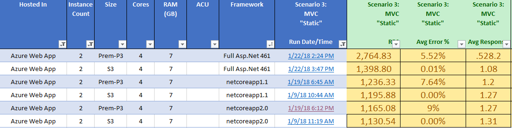

# A naive Performance Evaluation of Azure App Service

## Overview
The purpose of this exercise is to provide a baseline performance indicator when comparing different services hosted in Azure. 

## Project Context:
When deploying various Asp.Net Core apps (using various frameworks including .netcore 2.0, .netcore 1.1, .net Framework 4.6.1 ), with our business logic, we are seeing very poor performing Azure Web App deploymetns where we see < 100 Requests/Sec.

To find what one might expect as a baseline from an Azure App Service deployment vs a VM deployment, we decided we needed to do an analyatlyic assessment of the different permutations across different dotnet frameworks against how Azure App Service performs vs persistent VMs hosted in azure.

### Testing Web App
* The goal was to use the most basic of project with the bare minimum dependencies
* use as much as the Default out of the box configuration - similar to executing ```dotnet new web```
* Have two test cases:
  1. "**static**" web page - A web controller that given a "GET" request, would return back a string of characters - similar to the default "ValuesController" that generates an api/values endpoint that returns a string. As this is just a string of characters, we would expect that this would be best performant Controller call that would exist.
  2. "**status**" web page - A web controller that given a "GET" request, would grab the version of the binary dll, and return that back as a string. This would be expected to perform nearly the equivelent of the "Static" call, but perform slightly worse as it would need to do a file read to get the dll version.

### Asp.Net Benchmarch Numbers
Based upon this, we were hoping that we'd see performance numbers similar to Asp.Net benchmarks (https://github.com/aspnet/benchmarks), which if you look at the numbers, it calls out a Asp.net 4.6 IIS hosted Asp.net app can recieve 51k Requests per second. It's worth noting that these tests execute on two physical machines that are connected via a physical switch - meaning it would not be reasonable to expect these performance numbers in Azure - But still...it's a heck of a place to start.

It's also worth noting that they are using a tool called wrk (https://github.com/wg/wrk) to generate the load for these tests.

Detailed Results are called out here: https://aka.ms/aspnet/benchmarks.

---
---

## Hosting Posibilities

When we talk about hosting our services in azure, we are tethered to using a Windows Based Operating system due to our dependency on the Full asp.net Framework or the .net core 4.6.1 runtime. Given this requirement, we belive the following options are available to host our apps:

Hosting Options:
1. Azure App Service using App Service Plan to host the app(s) with a Network Load Balancer
2. Azure VMs behind a Network Load Balancer
3. Azure VMScale Sets behind a Network Load Balancer
4. Azure Service Fabric Hosted within a VM Scale Set with our Web App deployed into Service Fabric
5. Hosted in a docker container
    - using AKS (Azure Kubernetes Service)
    - using App Service to host the docker container
    - using Service fabric to host the docker container
6. Host Apps in App Service Environment (ASE) - Similar to #1, only dedicated

For Simplicity sake, we can effectively rule out options 4 & 5 out of this performance evalation as we simply do not have the time or resources to cover all 5 options at this time. 


## Naive Performance Expermentation - Azure App Service Edition
Before finding the optimal deployment mechanism (VM scale set vs App Service), the basis of our test was to first find the upper limit of what azure app service could handle.

### Azure App Service Configuration
To make this a reproducable test, We used the following configuration/requirements
* The azure deployment should consist of an ARM template that deploys:
    - Web Hosting Plan
    - Web Application
* All Azure Hosting Plans would use the "Standard" vm type of size Large (S3)
    - 4 cores
    - 7 GB RAM
* minimize any custom Web server optimizations - basically see what we can get "out of the box" when deploying the app service

---

### The Source code: Asp.net Solution setup
So we spun up a solution called "Data.Performance" that had several solutions:

1. Create a base "Deploy" project for the ARM Template
    * **Project Name: "Data.Performance.Deploy"**
    * Used VS2017 to create a new Resource Group Deployment project
    * Created Template under "WebSiteTests" folder that would deploy:
        * qty (4) Azure App Hosting Plan servers of a given size (by parameter file)
        * qty (4) Azure App Service Web Apps 
2. .Net Core project that uses the ```netcoreapp2.0``` runtime framework
    * **Project Name:** ==> **"Data.Performance.AspNetCore2.WebAPI"**
    * **Project Location:** ==> **"Data.Performance.BaseTests\src\Data.Performance.AspNetCore2.WebAPI\"**
    * Used VS2017 to create a new project using File->New Project, and selecting the base Asp.net Core 2.0 web api project
    * Create a controller called "StatusController.cs" that would return back the version of the API in string notation when /status was visited
    * Create a controller called "StaticController.cs" that would return back a static string when /static is visited.
3. .Net Core project that uses the ```netcoreapp1.1```  runtime framework
    * **Project Name:** ==> **"Data.Performance.AspNetCore11.WebAPI"**
    * **Project Location:** ==> **"Data.Performance.BaseTests\src\Data.Performance.AspNetCore11.WebAPI\"**
    * Used VS2017 to create a new project using File->New Project, and selecting the base Asp.net Core 1.1 web api project
    * Create a controller called "StatusController.cs" that would return back the version of the API in string notation when /status was visited
    * Create a controller called "StaticController.cs" that would return back a static string when /static is visited.
4. .Net Core project that uses the ```net461```  runtime framework
    * **Project Name:** **"Data.Performance.AspNetCore461.2015"**
    * **Project Location:** ==> **"Data.Performance.BaseTests\src\Data.Performance.AspNetCore461.WebAPI"**
    * Project creation wasn't easy unfortunatly. After several failed configuration permutations, I ended up: 
        * Falling back to launching VS2015, 
        * Creating a new asp.net core 1.1 project (Xproj)
        * Changed runtime from netcoreapp1.1 to net461
        * ran ```dotnet migrate``` from command line to convert it to a csproj
    * Create a controller called "StatusController.cs" that would return back the version of the API in string notation when /status was visited
    * Create a controller called "StaticController.cs" that would return back a static string when /static is visited.
5. Asp.Net project that uses the **NON-NETCORE -- ie full runtime** of ```net461``` full runtime framework
    * **Project Name:** "Data.Performance.AspNet461.WebAPI"
    * Use VS2017 to create a new project using File->New Project, and selecting the base Asp.net Core 1.1 web api project
    * Create a controller called "StatusController.cs" that would return back the version of the API in string notation when /status was visited
    * Create a controller called "StaticController.cs" that would return back a static string when /static is visited.
6. [FUTURE - Not implemented yet] Asp.Net Core project that uses the ```netcoreapp1.0```  runtime framework
    * **Project Name:** "Data.Performance.AspNetCore10.WebAPI"
    * Use VS2017 to create a new project using File->New Project, and selecting the base Asp.net Core 1.1 web api project
    * Create a controller called "StatusController.cs" that would return back the version of the API in string notation when /status was visited
    * Create a controller called "StaticController.cs" that would return back a static string when /static is visited.

---

### Deploying the Web Apps to the App Service

* Initially, my goal was to not need to create a build definition & add deployment steps
* This quickly fell apart when I realized that for whatever reason I couldn't use the "Publish" command in Visual Studio to deploy the .net Core project with framworks for net461 or aspnetcore1.1. Even tho the deployment would "Succeed", the publish commands weren't copying out the .dll/.exe from the project
* I ended up setting up a build defintion that had the steps for each project/deployment:
    * dotnet restore
    * dotnet build
    * dotent publish (to .zip)
    * stop webapp 
    * deploy webapp from .zip
    * start webapp
* This sucked that I had to got this length, but it ended up doing the trick to deploy the project. I really need to circle back on why i can't deploy net461 via publish.

So to actually get the code out there, it takes the following steps:
1. Run the ARM template located in ./Data.Performance.Deploy/WebSiteTests/deploy.ps1. This will create the sites in azure
2. Create a build definition that goes through the steps above for each project type
3. Kick off a build - this will deploy the code to the web sites you setup in step #1

Example Build Definition:


#### ARM Template - App Service - Hosting Plan

```json
{
    "type": "Microsoft.Web/serverfarms",
    "sku": {
        "name": "[parameters('web_HostingPlan_SKU_Name')]",
        "tier": "[parameters('web_HostingPlan_SKU_Tier')]",
        "size": "[parameters('web_HostingPlan_SKU_Name')]",
        "family": "[parameters('web_HostingPlan_SKU_Family')]",
        "capacity": "[parameters('web_HostingPlan_SKU_Capacity')]"
    },
    "kind": "app",
    "name": "[variables('ws_1_hp_Name')]",
    "apiVersion": "2016-09-01",
    "location": "[resourceGroup().location]",
    "scale": null,
    "properties": {
        "name": "[variables('ws_1_hp_Name')]",
        "workerTierName": null,
        "adminSiteName": null,
        "hostingEnvironmentProfile": null,
        "perSiteScaling": false,
        "reserved": false,
        "targetWorkerCount": 0,
        "targetWorkerSizeId": 0
    },
    "dependsOn": []
},
```

#### ARM Template - App Service - Web Site

```json
        {
            "apiVersion": "2015-08-01",
            "type": "Microsoft.Web/sites",
            "name": "[variables('ws_1_Name')]",
            "location": "[resourceGroup().location]",
            "properties": {
                "name": "[variables('ws_1_Name')]",
                "serverFarmId": "[resourceId('Microsoft.Web/serverfarms', variables('ws_1_hp_Name'))]",
                "siteConfig": {
                    "alwaysOn": true
                }
                //"clientAffinityEnabled": false
            },
            "dependsOn": [
                "[concat('Microsoft.Web/serverfarms/', variables('ws_1_hp_Name'))]"
            ],
            "resources": [ ]
        },
```

#### App Service - Deployed Resources:


---

### Deploying the VM Scale Set

Simply run the ARM template located in ./Data.Performance.Deploy/ScaleSet/deploy-ARM.ps1. This should execute the following steps:

```
    # Invokes arm template to Deploy Base resources from ARM Template & Run Extensions
    deploy-ARM.ps1
        ==>  ARM.PIP
        ==>  ARM.Network
        ==>  ARM.LoadBalancer
        ==>  ARM.VMSS
        ==>  ARM.VMSS.DSCExecution
                ==> Copies down Vital.IIS.zip
                ==> Executes dsc-IIS-DefaultSite.ps1
```

There is a bit of wonkiness in the script. Problems that I've seen:

* Script can take up to 30 minutes to execute
* Windows Features can take forever to execute
* Sometimes when executing the dsc script, the steps get hosed up on downloading & 
    * installing the dotnet Hosting core:  (https://aka.ms/dotnetcore-1-windowshosting) or (https://aka.ms/dotnetcore-2-windowshosting). 
    * Installing the SDK: https://dot.net/v1/dotnet-install.ps1

#### ARM Template - VM Scale Set - VM

```json
{
        "type": "Microsoft.Compute/virtualMachineScaleSets",
        "name": "[variables('namingInfix')]",
        "location": "[resourceGroup().location]",
        "apiVersion": "2016-04-30-preview",
        "dependsOn": [
          "[concat('Microsoft.Network/loadBalancers/', variables('loadBalancerName'))]",
          "[concat('Microsoft.Network/virtualNetworks/', variables('virtualNetworkName'))]"
        ],
        "sku": {
          "name": "[parameters('vmSku')]",
          "tier": "Standard",
          "capacity": "[parameters('instanceCount')]"
        },
        "properties": {
          "overprovision": "true",
          "upgradePolicy": {
            "mode": "Automatic"
          },
          "virtualMachineProfile": {
            "storageProfile": {
              "osDisk": {
                "caching": "ReadWrite",
                "createOption": "FromImage"
              },
              "imageReference": "[variables('imageReference')]"
            },
            "osProfile": {
              "computerNamePrefix": "[variables('vm_namingInfix')]",
              "adminUsername": "[parameters('adminUsername')]",
              "adminPassword": "[parameters('adminPassword')]"
            },
            "networkProfile": {
              "networkInterfaceConfigurations": [
                {
                  "name": "[variables('nicName')]",
                  "properties": {
                    "primary": "true",
                    "ipConfigurations": [
                      {
                        "name": "[variables('ipConfigName')]",
                        "properties": {
                          "subnet": {
                            "id": "[concat('/subscriptions/', subscription().subscriptionId,'/resourceGroups/', resourceGroup().name, '/providers/Microsoft.Network/virtualNetworks/', variables('virtualNetworkName'), '/subnets/', variables('subnetName'))]"
                          },
                          "loadBalancerBackendAddressPools": [
                            {
                              "id": "[concat('/subscriptions/', subscription().subscriptionId,'/resourceGroups/', resourceGroup().name, '/providers/Microsoft.Network/loadBalancers/', variables('loadBalancerName'), '/backendAddressPools/', variables('bePoolName'))]"
                            }
                          ],
                          "loadBalancerInboundNatPools": [
                            {
                              "id": "[concat('/subscriptions/', subscription().subscriptionId,'/resourceGroups/', resourceGroup().name, '/providers/Microsoft.Network/loadBalancers/', variables('loadBalancerName'), '/inboundNatPools/', variables('natPoolName'))]"
                            }
                          ]
                        }
                      }
                    ]
                  }
                }
              ]
            },
            "extensionProfile": {
              "extensions": [
                {
                  "name": "Microsoft.Powershell.DSC",
                  "properties": {
                    "publisher": "Microsoft.Powershell",
                    "type": "DSC",
                    "typeHandlerVersion": "2.21",
                    "autoUpgradeMinorVersion": true,
                    "forceUpdateTag": "[parameters('powershelldsc_UpdateTagVersion')]",
                    "settings": {
                      "configuration": {
                        "url": "[variables('powershelldscZipFullPath')]",
                        "script": "[parameters('powershelldsc_script')]",
                        "function": "[parameters('powershelldsc_function')]"
                      },
                      "configurationArguments": {
                        "nodeName": "localhost",
                        "WebDeployPackagePath": "[variables('webDeployPackageFullPath')]"
                      }
                    }
                  }
                }
              ]
            }
          }
        }
      }
    ],
```

#### VM Scale Set - Deployed Resources:


---

### Deploying the VM Standalone (with Load Balancer)

Simply run the ARM template located in ./Data.Performance.Deploy/ScaleSet/deploy-ARM.ps1. This should execute the following steps:

```
    # Invokes arm template to Deploy Base resources from ARM Template & Run Extensions
    deploy-ARM.ps1 
        ==>  ARM.PIP
        ==>  ARM.Network
        ==>  ARM.LoadBalancer
        ==>  ARM.VMSS
        ==>  ARM.VMSS.DSCExecution
                ==> Copies down Vital.IIS.zip
                ==> Executes dsc-IIS-DefaultSite.ps1
```

There is a bit of wonkiness in the script. Problems that I've seen:

* Script can take up to 30 minutes to execute
* Windows Features can take forever to execute
* Sometimes when executing the dsc script, the steps get hosed up on downloading & 
    * installing the dotnet Hosting core:  (https://aka.ms/dotnetcore-1-windowshosting) or (https://aka.ms/dotnetcore-2-windowshosting). 
    * Installing the SDK: https://dot.net/v1/dotnet-install.ps1

#### ARM Template - VM

```json
    {
      "apiVersion": "2017-03-30",
      "type": "Microsoft.Compute/virtualMachines",
      "name": "[concat(variables('vm_name_prefix'), copyindex())]",
      "copy": {
        "name": "virtualMachineLoop",
        "count": "[variables('vm_NumOfInstances')]"
      },
      "location": "[resourceGroup().location]",
      "tags": {
        "displayName": "VirtualMachines",
        "App": "[parameters('appName')]",
        "Env": "[parameters('envName')]"
      },
      "dependsOn": [
        "[concat('Microsoft.Network/networkInterfaces/', variables('vm_nic_name'), copyindex())]",
        "[concat('Microsoft.Compute/availabilitySets/', variables('vm_availset_name'))]",
        "[variables('vm_mngstorage_disk1_id')]"
      ],
      "properties": {
        "availabilitySet": {
          "id": "[resourceId('Microsoft.Compute/availabilitySets',variables('vm_availset_name'))]"
        },
        "hardwareProfile": {
          "vmSize": "[parameters('vm_Size')]"
        },
        "osProfile": {
          "computerName": "[concat(variables('vm_name_prefix'), copyIndex())]",
          "adminUsername": "[parameters('vm_admin_username')]",
          "adminPassword": "[parameters('vm_admin_password')]"
        },
        "storageProfile": {
          "imageReference": {
            "publisher": "[variables('vm_ImagePublisher')]",
            "offer": "[variables('vm_ImageOffer')]",
            "sku": "[variables('vm_ImageSKU')]",
            "version": "latest"
          },
          "osDisk": {
            "createOption": "FromImage"
          },
          "dataDisks": [
            {
                "lun": 0,
                "name": "[variables('vm_mngstorage_disk1_name')]",
                "createOption": "Attach",
                "managedDisk": {
                    "id": "[variables('vm_mngstorage_disk1_id')]"
                }
            }
          ]
        },
        "networkProfile": {
          "networkInterfaces": [
            {
              "properties": {
                "primary": true
              },
              "id": "[resourceId('Microsoft.Network/networkInterfaces',concat(variables('vm_nic_name'),copyindex()))]"
            }
          ]
        }
      }
    },
```

#### VM - Deployed Resources:


---
---


### Executing the Load Tests:

* We have used Microsoft Load tests in the past, but recently our dev team moved over to using Blazemeter (https://www.blazemeter.com/).
* I setup a Project called "Justin-Tests", and under that I created a bunch of tests:

    | Project Type | Framework     | Test Type |
    | ------------ |:-------------:|:-------------:|
    | Asp.Net Core | netcore2.0 | Static Web Page |
    | Asp.Net Core | netcore2.0 | Status Web Page |
    | Asp.Net Core | netcore1.1 | Static Web Page |
    | Asp.Net Core | netcore1.1 | Status Web Page |
    | Asp.Net Core | net461 | Static Web Page |
    | Asp.Net Core | net461 | Status Web Page |
    | Asp.Net      | net461 | Static Web Page |


* In each test, i used a baseline of 1500 virtual Users, which resulted in Blazemeter spinning up:

    * All tests originate from East US 2 - Which is where our apps our hosted
    * 3 "engines" with 500 threads per engine. 
    * Each engine would have a different IP, so this would result in Azure getting pinged by 3 different IPs, with 500 threads off of each IP
    * a Rampup of 0 seconds (no ramp-up)
    * Infinite amount of Iterations (just keep hitting the same url over and over)
    * run for a duration of 2 minutes
    * Delay between iterations of 0 seconds (no delay )
    * Urls that were getting executed by jmeter looked like:
        * https://datad-ptest-netfx-ws.azurewebsites.net/static
        * https://datad-ptest-netfx-ws.azurewebsites.net/status


## Performance Results

* So in thinking that we'd get somewhere near 52000 rps, we fell to a < 1000 rps for a single server. 
* Based on other tests where we got an equivelent App Serivce, we were seeing that the vm hosted instances were getting 10,000 rps

---

### Results - .NetCore 2.0 
* I would have expected that if the a single web app server were to return 800 rps, that two servers would get 1600. This wasn't the case.


| Host    | Name         | Framework   | Test Type |  Virtual Users | Host Count | Req/Sec | % Error | Avg Response | 
| ------- | ------------ | ----------- | ----- | :-------------:  | :-----:  | :-----:  | :-----:  | :-----: |
| Web App | Asp.Net Core | netcore2.0 | Static (read string) | 1500 | 1 vm | 876 rps | 0% | 1.7 s |
| Web App | Asp.Net Core | netcore2.0 | Status (read file) | 1500 | 1 vm | 785 rps | 0% | 1.89 s |
| Web App | Asp.Net Core | netcore2.0 | Static (read string) | 1500 | 2 vm | 1131 rps | 0% | 1.31 s |
| Web App | Asp.Net Core | netcore2.0 | Status (read file) | 1500 | 2 vm | 1213 | 0% | 1.23 s |
| Web App | Asp.Net Core | netcore2.0 | Static (read string) | 3000 | 10 vm | 6665.97 | 66% | .44 s |
| VM ScaleSet | Asp.Net Core | netcore2.0 | Static (read string) | 1500 | 1 vm | not run | | |
| VM ScaleSet | Asp.Net Core | netcore2.0 | Status (read file) | 1500 | 1 vm | not run | | |
| VM ScaleSet | Asp.Net Core | netcore2.0 | Static (read string) | 1500 | 2 vm | not run | | |
| VM ScaleSet | Asp.Net Core | netcore2.0 | Status (read file) | 1500 | 2 vm | not run | | |
| VM ScaleSet | Asp.Net Core | netcore2.0 | Static (read string) | 3000 | 10 vm | not run | | |


* When scaling from 2 vm hosts to 10, the error rate when drastically up where basically the net success was minimal to a shocking number
* If you compare the previous image of 10 hosts to a one with 2 paas hosts, the image looks like the image below - with 0% errors. 


---

### Results - .NetCore 1.1 
| Host    | Name         | Framework   | Test Type |  Virtual Users | Host Count | Req/Sec | % Error | Avg Response | 
| ------- | ------------ | ----------- | ----- | :-------------:  | :-----:  | :-----:  | :-----:  | :-----: |
| Web App | Asp.Net Core | netcore1.1 | Static (read string) | 1500 | 1 vm | 889 rps | 0% | 1.68 s |
| Web App | Asp.Net Core | netcore1.1 | Status (read file) | 1500 | 1 vm | 767 rps | 0% | 1.60 s |
| VM ScaleSet | Asp.Net Core | netcore1.1 | Static (read string) | 1500 | 1 vm | not run | | |
| VM ScaleSet | Asp.Net Core | netcore1.1 | Status (read file) | 1500 | 1 vm | not run | | |

---

### Results - .NetCore netfx(4.6.1 )

| Host    | Name         | Framework   | Test Type |  Virtual Users | Host Count | Req/Sec | % Error | Avg Response | 
| ------- | ------------ | ----------- | ----- | :-------------:  | :-----:  | :-----:  | :-----:  | :-----: |
| Web App | Asp.Net Core | net461 | Static (read string) | 1500 | 1 vm | 722 rps | 0% | 2.09 s |
| Web App | Asp.Net Core | net461 | Status (read file) | 1500 | 1 vm | 753 rps | 0% | 2.0 s |
| VM ScaleSet | Asp.Net Core | net461 | Static (read string) | 1500 | 1 vm | not run | | |
| VM ScaleSet | Asp.Net Core | net461 | Status (read file) | 1500 | 1 vm | not run | | |

---


## Observations - ASP.Net Core 2.0

### **Theory0:** ==> Azure App Service should perform approx equivlent to running in a VM when running on equivelent vm size

* Data:
  * Compare .NetCore 2.0/1.1 on Azure App Service vs .NetCore 2.0/1.1 on VMSS
    * 

  * [TODO] Compare .NetCore 2.0/1.1/.netcore461 on Azure App Service to .netcore 2.0/1.1/.netcore461 on Azure VM

  * [TODO] Compare native full 4.6.1 runtime on App Service to native full 4.6.1 runtime on Azure VM
 
* Result: **False**
  * The numbers clearly are in favor of App Service perfoming clearly worse than an equivlent VM - ~3,000 vs ~800 is a significant difference!
  * Could attribute to the fact of being in public tenant - however, I Wouldn't expect the numbers to be that different

* Discussion:
  * Intuition says that since App Service are just VMs at the end of the day, these numbers are baffling. If there was one item i'd like to get to the bottom of, it's why the performance of App Service is so much worse than vms.
  * To be fair, it'd be interesting to see the results of a native VM vs App Service (instead of a VM Scale Set, which is what these numbers represent)


### **Theory1:** ==> Azure Web Apps with 2 instances should perform better than a Web App with one instance.

* Data:
  - 
  - 
  - 

* Result: **True**
  - Azure Web App performs slightly better when you deploy 2 instances vs 1 instance
  - 1 host performs at roughly .60 of the performance of 2 hosts.

* Discussion:
  * .40 performance increase seems somewhat reasonable due to the load balancing and so forth
  * The concern I have is why i start seeing a high incident of failures with more hosts - See Theory6 below.

### **Theory2:** ==> Azure Web Apps with a Premium Hosting Plan should outperform Standard Hosting Plans.

* Data:
  * .NetCore 2.0 Premium vs Standard
    * 

  * .NetCore 1.1 Premium vs Standard
    * 

  * .Netcore running 4.6.1 framework Premium vs Standard
    * 

  * The number of instances doesn't seem to have an impact - even with 2 instances, premium vs standard is roughly equivelent
    * 

* Result: **False**
  * Azure Web App Premium & Standard perform at roughtly the same.
  * sometimes Premium is worse, sometimes it's better
  
* Discussion:
  * This doesn't make sense - shouldn't premium be better?
  * Need help/guidance into why this is the case.

### **Theory3:** ==> .Net core 2.0 should have better performance than .Net Core 1.1 or .Net Core 1.0 or .Net Core running 4.6.1 (Premium & Standard Hosting Plans).

* Data: 
  * .NetCore 2.0 vs .NetCore 1.1 on App Service
    * 

  * .NetCore 2.0 vs .Net Core running full 4.6.1 runtime on App Service
    * 

  * .NetCore 2.0 vs .NetCore 1.1 on VM ScaleSet
    * 
   
  * .NetCore 2.0 vs .Net Core 1.1 on VM Scale Sets
    * 

* Result: **Sometimes True, Sometimes False**
  * It looks like .net Core 2.0 runs at about the same performance of .Net Core 1.0 & .Net Core 1.1

* Discussion:
  * This seems somewhat reasonable - for the most part, this is a really simple app, so I woudl think there would be differences in how different runtime would perform differently based upon the actions they are taking.

### **Theory4:** ==> .Net core 2.0 should have better performance than native full 4.6.1 runtime.

* Data: 
  * .NetCore 2.0 vs .NetCore 1.1 vs .Net Core running 4.6.1 vs native full 4.6.1 runtime on App Service
    * 

  * .NetCore 2.0 vs native full Runtime on VM - Note high level of failures seems odd
    * 

* Result: **False**
  * .Net Core 2.0/1.1/netfx4.6.1 runs at ~ .64 that performance that Native Full asp.net 4.6.1 runs

* Discussion:
  * Does this mean that in general the App Service is generally more performant when running native asp.net framework over .net core?
  * I understand there are limitations of the number of connections that AppService can have incoming/outgoing, and due to the way that .net core on windows runs, it's behind a proxy, so it eats up 2 connections - but then shouldn't the performance be .50, not .64?

### **Theory5:** ==> Azure Scale Sets behind a load balancer should perform equivelently to Azure VMs hosted behind a Load Balancer

* Data:
  * Compare .NetCore 2.0 on Azure VM vs .NetCore 2.0 on VMSS
    * 

* Result:**False**
  * VMSS Seems to perform better even tho I used premium storage
  * Could use more tests to reinforce the data to show it's not an outlier
  * I'd like to understand why VMSS performas better than a vm. Is the load balancer different? What tier of storage does VMSS use?

### **Theory6:** ==> Azure App Service with many (~10) should clearly outperform Azure App Service with 1 instance

* Data:
  * Compare various frameworks on 1, 2, and 10 instances
    * 

  * 10 Intance executed on 1/9 @ 12:31 PM
    * 

    * 
    
    * 

  * 10 Intance executed on 1/9 @ 11:56 AM
    * 

    * 

* Result:
  * Why are we getting so many failures? Is this a problem with App Service or with BlazeMeter? 


Theories I didn't get to:
- Host Apps in App Service Environment (ASE) should have better performance than in App Service due to ASE being dedicated
- Apps hosted in App Service should perform with equivleent performance of Service Fabric.
- Because we see high number of failures when using an App Service with 10 instances, it would be intersting to run a test where we test with 1..2..3..4..5..10 until we see failures begin to increase.
- Execute a break tests to find out at what point a the App Service will tip over with 1 Host against .netcore1.1/2.0/core461/fullAsp.Net4.6.1
- Execute a break tests to find out at what point a the VM will tip over with 1 Host against .netcore1.1/2.0/core461/fullAsp.Net4.6.1
- Execute a break tests to find out at what point a the VMSS will tip over with 1 Host against .netcore1.1/2.0/core461/fullAsp.Net4.6.1
- Execute a break tests to find out at what point a the ServiceFabric will tip over with 1 Host against .netcore1.1/2.0/core461/fullAsp.Net4.6.1
- Execute a break tests to find out at what point a the Docker container will tip over with 1 Host against .netcore1.1/2.0/core461/fullAsp.Net4.6.1
- Compare performance of running Asp.net Core 2/1.1/netfx with IIS+Kestrel vs Kestrel only.
- COmpare performance of running Asp.Net Core 2/1.1 with Kestrel on Windows OS vs Linux OS

### **Theory8:** ==> 
* Data:

* Result: 
  * 